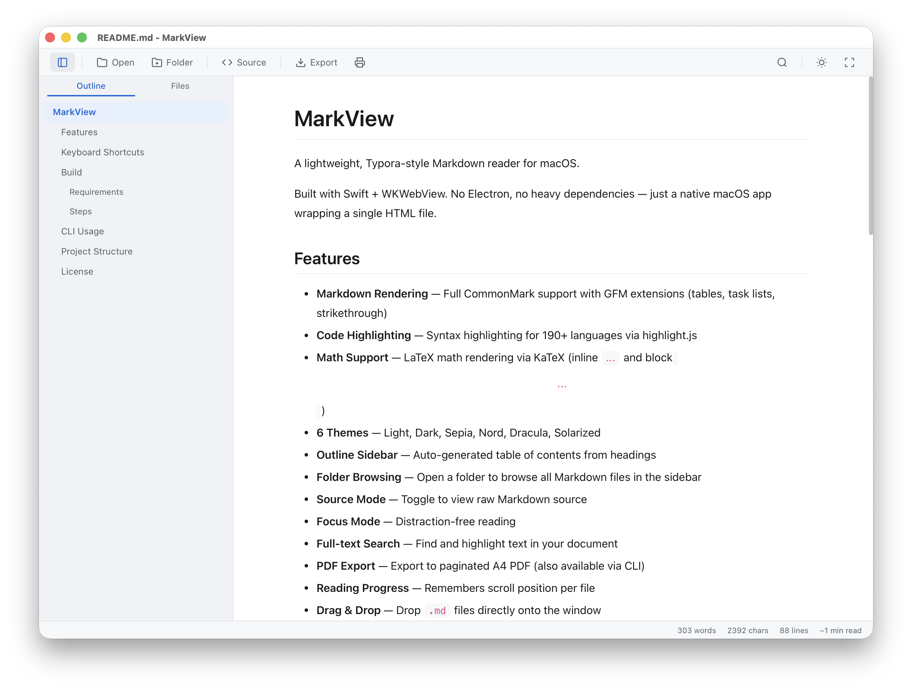

# MarkView

A lightweight, Typora-style Markdown reader for macOS.

Built with Swift + WKWebView. No Electron, no heavy dependencies — just a native macOS app wrapping a single HTML file.



## Features

- **Markdown Rendering** — Full CommonMark support with GFM extensions (tables, task lists, strikethrough)
- **Code Highlighting** — Syntax highlighting for 190+ languages via highlight.js
- **Math Support** — LaTeX math rendering via KaTeX (inline `$...$` and block `$$...$$`)
- **6 Themes** — Light, Dark, Sepia, Nord, Dracula, Solarized
- **Outline Sidebar** — Auto-generated table of contents from headings
- **Folder Browsing** — Open a folder to browse all Markdown files in the sidebar
- **Source Mode** — Toggle to view raw Markdown source
- **Focus Mode** — Distraction-free reading
- **Full-text Search** — Find and highlight text in your document
- **PDF Export** — Export to paginated A4 PDF (also available via CLI)
- **Reading Progress** — Remembers scroll position per file
- **Drag & Drop** — Drop `.md` files directly onto the window
- **File Association** — Register as a viewer for `.md`, `.markdown`, `.mdown`, `.mkd`, `.mdx`, `.txt`

## Keyboard Shortcuts

| Shortcut | Action |
|---|---|
| `⌘ O` | Open file |
| `⌘ \` | Toggle sidebar |
| `⌘ /` | Toggle source mode |
| `⌘ F` | Search |
| `⌘ ⇧ E` | Export as PDF |
| `⌘ P` | Print |
| `F11` | Focus mode |
| `Esc` | Close search / exit focus mode |

## Build

### Requirements

- macOS 13.0+
- Xcode Command Line Tools (for `swiftc`)
- Python 3 (for icon generation)

### Steps

```bash
cd build
bash build.sh
```

The script will:

1. Generate app icons via `generate_icon.py`
2. Compile `main.swift` with `swiftc`
3. Assemble `MarkView.app` bundle in `~/Downloads/`

Then open the app:

```bash
open ~/Downloads/MarkView.app
```

## CLI Usage

Export a Markdown file to PDF without opening the GUI:

```bash
~/Downloads/MarkView.app/Contents/MacOS/MarkView example.md --export-pdf output.pdf
```

## Project Structure

```
.
├── index.html          # Frontend: all HTML/CSS/JS in one file
├── build/
│   ├── main.swift      # Native macOS app (AppKit + WKWebView)
│   ├── Info.plist      # App bundle metadata & file associations
│   ├── build.sh        # Build script
│   ├── generate_icon.py # Generates app icon programmatically
│   └── AppIcon.iconset/ # Generated icon assets
└── README.md
```

## License

MIT
